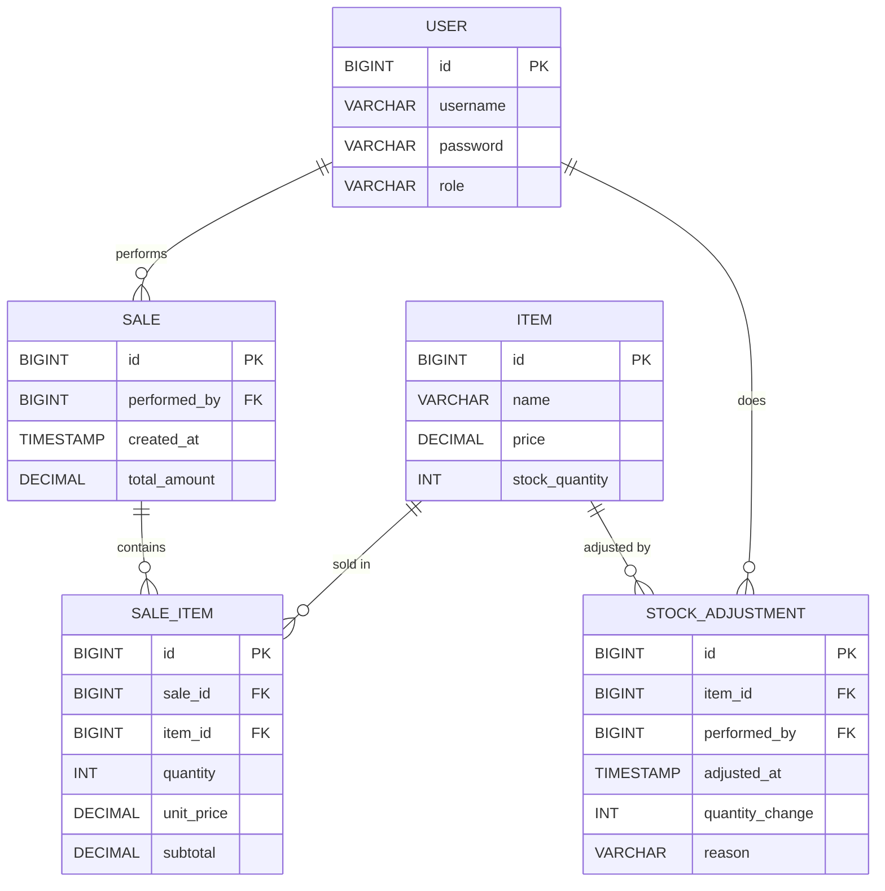

```mermaid
erDiagram

    USER {
        BIGINT id PK
        VARCHAR username
        VARCHAR password
        VARCHAR role
    }

    ITEM {
        BIGINT id PK
        VARCHAR name
        DECIMAL price
        INT stock_quantity
    }

    SALE {
        BIGINT id PK
        BIGINT performed_by FK
        TIMESTAMP created_at
        DECIMAL total_amount
    }

    SALE_ITEM {
        BIGINT id PK
        BIGINT sale_id FK
        BIGINT item_id FK
        INT quantity
        DECIMAL unit_price
        DECIMAL subtotal
    }

    STOCK_ADJUSTMENT {
        BIGINT id PK
        BIGINT item_id FK
        BIGINT performed_by FK
        TIMESTAMP adjusted_at
        INT quantity_change
        VARCHAR reason
    }

    USER ||--o{ SALE : "performs"
    SALE ||--o{ SALE_ITEM : "contains"
    ITEM ||--o{ SALE_ITEM : "sold in"
    ITEM ||--o{ STOCK_ADJUSTMENT : "adjusted by"
    USER ||--o{ STOCK_ADJUSTMENT : "does"

```